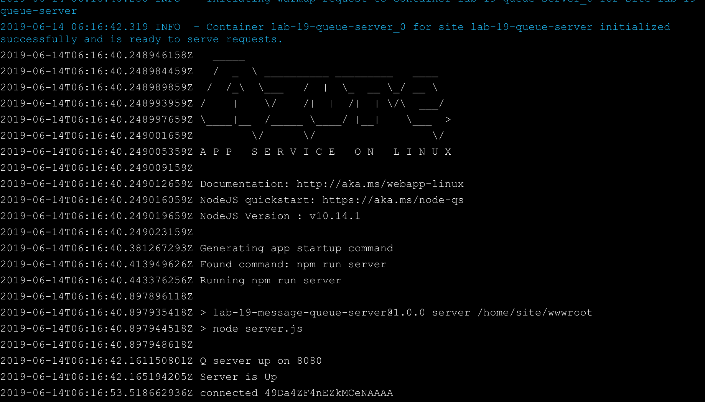
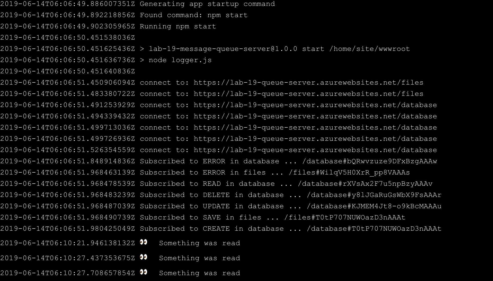

# BLOCK - 04

## Cloud Server Deployment

### Author: Joé Jemmely

### Links and Resources

- [submission PR](http://xyz.com)
- [travis](http://xyz.com)
- [back-end](http://xyz.com) (when applicable)
- [front-end](http://xyz.com) (when applicable)

#### Tests

Use Postman to POST, PUT, DELETE records in the API

- 
- 
- 
- 

View logs on Azure Server

- The Q Server at AWS should broadcast the events
  - 
- The Logger server at Azure should respond to them
  - 
